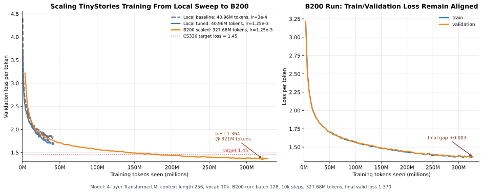
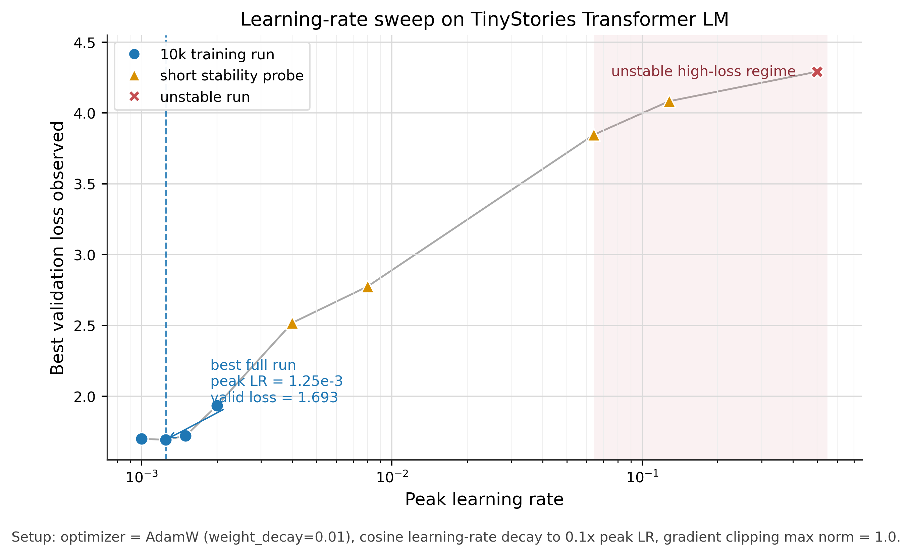

# TransformerLM From Scratch

From-scratch implementation and experimental record for a compact GPT-style
language model trained on TinyStories, extended from CS336 Assignment 1.

The main line of this repository is under `cs336/`: implementation modules,
training launchers, experiment logs, figures, and sampling scripts.

## Overview

This repository contains the full training path for a small TransformerLM:
tokenizer training, model components, optimizer, training loop, evaluation,
checkpointing, GPU experiments, and qualitative decoding analysis.

| Area | Contents |
| --- | --- |
| Tokenization | BPE training, encode / decode, TinyStories preprocessing |
| Model | RMSNorm, RoPE, causal multi-head attention, SwiGLU FFN, TransformerLM |
| Optimization | AdamW, cosine learning-rate schedule, gradient clipping |
| Training system | checkpointing, evaluation loop, CSV metrics, GPU telemetry |
| Experiments | local LR sweep, B200 long run, decoding and preprocessing analysis |

## Experiment Setup

| Item | Setting |
| --- | --- |
| Dataset | TinyStories |
| Vocabulary size | 10,000 |
| Context length | 256 |
| Model | 4 layers, `d_model=512`, 16 heads, `d_ff=1344` |
| Scale | about 17M parameters |
| Optimizer | AdamW |
| Schedule | warmup + cosine decay |
| Main run | single NVIDIA B200 |
| Training budget | 10,000 steps, batch size 128, about 327.68M tokens seen |

## Results

| Metric | Value |
| --- | ---: |
| Best validation loss | 1.3637 |
| Best validation step | 9,800 |
| Final validation loss | 1.3696 |
| Final train loss | 1.3670 |
| B200 training time | 1,454.21s |
| Approx. throughput | about 225k tokens/s |
| Active GPU utilization | about 98-99% |
| GPU memory used | about 17.7 GiB |

## Training Curves

### B200 TinyStories Loss



### Learning Rate Sweep



## Analysis Notes

### Optimization

The learning-rate sweep showed that instability does not always appear as an
immediate `NaN`. Gradient clipping and cosine decay can reduce the damage from
large updates, so an overly aggressive learning rate may first show up as slower
convergence, worse validation loss, or degraded generations.

Larger batch sizes made the optimization trajectory less noisy. Larger
`eval_iters` made validation estimates more stable. In the main TinyStories
runs, train and validation losses stayed close, suggesting that this model was
learning the dataset distribution without obvious overfitting at this scale and
training budget.

### Preprocessing Cost

For this small model, CPU-side text preprocessing was a major part of
end-to-end wall-clock time. In one measured TinyStories run, validation encoding
took `36.76s`, train encoding took `3508.71s`, and model training took
`1831.06s`. The train-set encoding pass alone was about `1.9x` the training
time, so caching encoded token IDs is important for fast iteration.

### Generation Behavior

Qualitative samples were generated from the final B200 checkpoint with
`cs336/scripts/generate_tinystories.py`. Nucleus sampling (`top_p`) produced more
flexible outputs than a fixed `top_k` cutoff for this checkpoint. Very high
temperatures quickly damaged semantic coherence and increased repetitive or
unstable text. For example, `temperature=2.0, top_p=0.9` often produced broken
phrases and token fragments, while low `top_p` values such as `0.1` produced
stable but more templated TinyStories-style continuations.

The strongest qualitative behavior came from in-distribution story prefixes. A
prefix such as "Once there was a little boy named Jun. Jun was afraid of the
dark. One night, he heard a noise under his bed." produced a fluent continuation
about fear, darkness, a comforting adult, and a friendly resolution. By contrast,
instruction-style prompts such as "tell a scary stories" produced fluent English
but did not reliably preserve the requested genre, and out-of-distribution
prompts such as Chinese text were usually copied briefly before the model
returned to English TinyStories-style prose.

This suggests that the low validation loss mainly reflects strong modeling of
the TinyStories distribution, not instruction following or broad semantic
understanding. Prompt control improves when the prompt is phrased as a
TinyStories continuation rather than as an instruction.

## Repository Structure

```text
.
├── cs336/
│   ├── ass1/assignment1-basics/
│   │   └── cs336_basics/
│   │       ├── tokenizer.py
│   │       ├── train_bpe.py
│   │       ├── TransformerLM.py
│   │       ├── loss_optimizer.py
│   │       ├── Training.py
│   │       ├── run_training.py
│   │       └── generating.py
│   ├── experiments/
│   │   ├── b200_lr1p25e-3_bs128_10k/
│   │   ├── lr_sweep_comparison_20260529/
│   │   └── perf_3070_20260528_202842/
│   ├── figures/
│   │   ├── lr_sweep_research_summary.png
│   │   ├── tinystories_b200_scaling_loss.svg
│   │   └── tinystories_b200_scaling_summary.csv
│   ├── modal_tinystories.py
│   └── scripts/
│       └── generate_tinystories.py
├── from-scratch-book/
├── docs/
└── README.md
```

## Entry Points

- `cs336/ass1/assignment1-basics/cs336_basics/`: core implementation modules.
- `cs336/modal_tinystories.py`: Modal launcher for B200 training runs.
- `cs336/scripts/generate_tinystories.py`: sampling script for trained checkpoints.
- `cs336/experiments/`: configs, metrics, checkpoints, telemetry, and plots.
- `docs/environment.md`: local environment notes.
