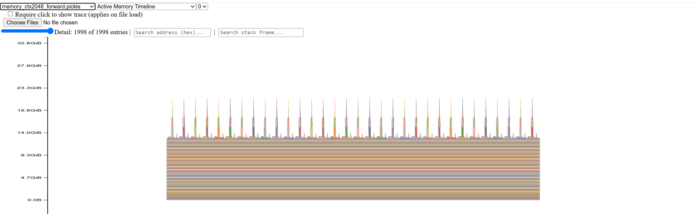
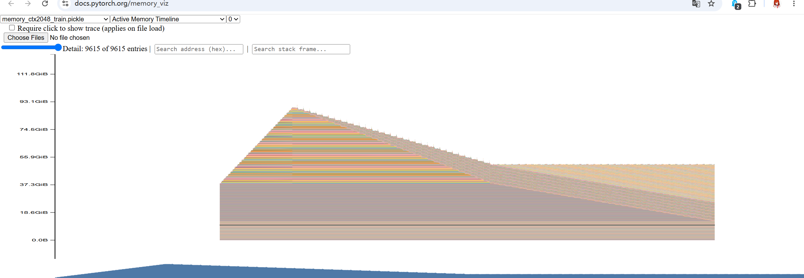

Problem (benchmarking_script):
| warmup | size   | d_model | d_ff  | layers | heads | forward s         | backward s        | optimizer s       |
| ------ | ------ | ------- | ----- | ------ | ----- | ----------------- | ----------------- | ----------------- |
| 0      | small  | 768     | 3072  | 12     | 12    | 0.0476 +/- 0.0934 | 0.0549 +/- 0.0675 | 0.0086 +/- 0.0006 |
| 0      | medium | 1024    | 4096  | 24     | 16    | 0.0664 +/- 0.0589 | 0.1126 +/- 0.0582 | 0.0174 +/- 0.0007 |
| 0      | large  | 1280    | 5120  | 36     | 20    | 0.1276 +/- 0.0644 | 0.2326 +/- 0.0657 | 0.0299 +/- 0.0002 |
| 0      | xl     | 2560    | 10240 | 32     | 32    | 0.3119 +/- 0.0469 | 0.5830 +/- 0.0346 | 0.0798 +/- 0.0003 |
| 0      | 10B    | 4608    | 12288 | 50     | 36    | 0.9645 +/- 0.0593 | 1.8885 +/- 0.0566 | OOM               |
| 1      | small  | 768     | 3072  | 12     | 12    | 0.0163 +/- 0.0002 | 0.0321 +/- 0.0001 | 0.0085 +/- 0.0004 |
| 1      | medium | 1024    | 4096  | 24     | 16    | 0.0468 +/- 0.0001 | 0.0933 +/- 0.0011 | 0.0172 +/- 0.0007 |
| 1      | large  | 1280    | 5120  | 36     | 20    | 0.1061 +/- 0.0001 | 0.2083 +/- 0.0009 | 0.0297 +/- 0.0001 |
| 1      | xl     | 2560    | 10240 | 32     | 32    | 0.2960 +/- 0.0002 | 0.5703 +/- 0.0013 | 0.0799 +/- 0.0006 |
| 1      | 10B    | 4608    | 12288 | 50     | 36    | 0.9446 +/- 0.0001 | 1.8713 +/- 0.0013 | OOM               |
| 2      | small  | 768     | 3072  | 12     | 12    | 0.0163 +/- 0.0000 | 0.0321 +/- 0.0001 | 0.0074 +/- 0.0000 |
| 2      | medium | 1024    | 4096  | 24     | 16    | 0.0468 +/- 0.0000 | 0.0926 +/- 0.0001 | 0.0164 +/- 0.0000 |
| 2      | large  | 1280    | 5120  | 36     | 20    | 0.1060 +/- 0.0000 | 0.2080 +/- 0.0006 | 0.0298 +/- 0.0002 |
| 2      | xl     | 2560    | 10240 | 32     | 32    | 0.2962 +/- 0.0002 | 0.5703 +/- 0.0012 | 0.0802 +/- 0.0006 |
| 2      | 10B    | 4608    | 12288 | 50     | 36    | 0.9449 +/- 0.0003 | 1.8706 +/- 0.0019 | OOM               |
| 5      | small  | 768     | 3072  | 12     | 12    | 0.0163 +/- 0.0000 | 0.0321 +/- 0.0000 | 0.0083 +/- 0.0002 |
| 5      | medium | 1024    | 4096  | 24     | 16    | 0.0469 +/- 0.0000 | 0.0928 +/- 0.0003 | 0.0173 +/- 0.0003 |
| 5      | large  | 1280    | 5120  | 36     | 20    | 0.1060 +/- 0.0000 | 0.2084 +/- 0.0007 | 0.0305 +/- 0.0004 |
| 5      | xl     | 2560    | 10240 | 32     | 32    | 0.2923 +/- 0.0002 | 0.5691 +/- 0.0007 | 0.0801 +/- 0.0003 |
| 5      | 10B    | 4608    | 12288 | 50     | 36    | 0.9438 +/- 0.0004 | 1.8669 +/- 0.0005 | OOM               |

(b):With 5 warm-up steps on the B200, the timing measurements were very stable: the standard deviations were small relative to the means for forward, backward, and optimizer-step timings across almost all model sizes.
(c): In contrast, removing warm-up steps substantially increased the variability, especially for forward and backward passes, because the first measured iterations include one-time CUDA runtime initialization, kernel/library setup, algorithm selection, memory allocation, lazy loading, and cache initialization.

Problem (nsys_profile): 
(a):For the small model at context length 256, Nsight Systems reports about 0.0435 s per forward pass from the benchmark_measure NVTX range. This matches the Python standard-library timing closely, which measured 0.0442 ± 0.0010 s per forward pass on the same RTX 3070 setup.
(b):For the small model, the dominant forward-pass CUDA kernel is `ampere_sgemm_128x64_tn` at context lengths 256, 512, and 1024; it appears 850 times over 10 captured forward passes, or 85 invocations per forward pass. In the forward+backward profile, the top kernel is the same for context lengths 256 and 512, but changes to `ampere_sgemm_128x64_nn` at context length 1024, with 720 total invocations or 72 per pass.
(c):Besides matrix multiplications, the forward pass spends non-trivial CUDA time in PyTorch elementwise and reduction kernels, including `vectorized_elementwise_kernel`, `elementwise_kernel`, `exp_kernel_cuda`, `where`/masking kernels, and `reduce_kernel` for max/sum reductions. These correspond mainly to residual/add/multiply operations, attention masking and softmax, and normalization-style reductions; although they account for far fewer FLOPs than GEMMs, they still take visible runtime because they are memory-bound and require many separate kernel launches.
(d):Compared with forward-only inference, the complete training step shifts noticeably more time into elementwise kernels: for the small model, elementwise runtime increases from 41.7% to 46.9% at context length 256, from 24.5% to 41.8% at 512, and from 27.5% to 37.2% at 1024. The matmul/GEMM fraction remains large but does not change monotonically: it drops at 256 and 512, while at 1024 it is slightly higher because the backward pass also introduces substantial GEMM work.
(e):In runtime, the softmax operation takes about `2.43x` as long as the attention matrix multiplication operations, even though the matrix multiplications account for about `51.2x` more FLOPs than softmax. This shows that FLOPs are a poor predictor for softmax runtime, since softmax is dominated more by memory access, reductions, exponentiation, and division rather than dense GEMM-style compute.

**additional**:Compared with the small model, the medium model spends a larger fraction of forward-pass CUDA time in GEMM kernels, indicating better dominance of dense matrix multiplication as model size increases. However, during a full training step, the medium model also shows a much larger contribution from elementwise and copy/memory kernels, especially from backward and AdamW state updates. The attention softmax result is qualitatively the same as in the small model

Problem (mixed_precision_accumulation):
Accumulating in float32 gives a nearly correct result, while accumulating in float16 introduces substantial error because every addition is rounded back to half precision. If the accumulator is float32 but the increment is first represented in float16, the result is still biased because `0.01` has already been rounded to its float16 value; casting it back to float32 preserves the rounded value but cannot recover the original decimal value.

Problem (benchmarking_mixed_precision):
(a): 
 - fp32
 - fp16
 - fp32
 - fp16
 - fp32
 - fp32

(b):
In LayerNorm, the parts most sensitive to mixed precision are primarily (x - mean), the variance calculation, and the mean calculation. 

If use BF16, there is no need to treat LayerNorm differently. Because BF16 has a wider dynamic range, the variance (acting as a scaling factor), reduction are less likely to overflow/underflow 

Furthermore, when calculating variance, we have to square the values and then sum them. Since the range of BF16 is already comparable to FP32, these types of precision issues generally won't occur, because insufficient range is more critical than a lack of precision.

(c):
| size   | forward FP32 s | forward BF16 s | forward speedup | backward FP32 s | backward BF16 s | backward speedup |
| ------ | -------------- | -------------- | --------------- | --------------- | --------------- | ---------------- |
| small  | 0.0163         | 0.0065         | 2.51x           | 0.0321          | 0.0135          | 2.37x            |
| medium | 0.0469         | 0.0157         | 2.98x           | 0.0928          | 0.0323          | 2.87x            |
| large  | 0.1060         | 0.0292         | 3.63x           | 0.2084          | 0.0590          | 3.53x            |
| xl     | 0.2923         | 0.0468         | 6.24x           | 0.5691          | 0.1054          | 5.40x            |
| 10B    | 0.9438         | 0.1135         | 8.31x           | 1.8669          | 0.2816          | 6.63x            |

As model scale increases, the time required for both forward and backward propagation grows. This means that the larger the model, the more significant the benefits of using mixed precision become.

Problem (memory_profiling):
(a):

For the inference-only forward profile at context length 2048, the active memory timeline stays near a relatively stable baseline, with periodic narrow spikes. I interpret these spikes as temporary attention-related allocations, especially attention score or softmax buffers, because they become much more visible at context length 2048 than at context length 128. This matches the fact that attention memory scales quadratically with sequence length. Since this is inference only, most of these temporary tensors are freed shortly after each layer, so the timeline does not show a long monotonic buildup.

For the full training-step profile, the broad shape makes the main stages easier to distinguish. The first rising region corresponds to the forward pass: each layer saves activations needed for backward, so active memory accumulates as the model moves through the layers. The peak or turning point occurs around the transition from forward to backward, when the saved activations are still live and backward computation begins to allocate temporary buffers and gradients. The long decreasing region corresponds to the backward pass: as gradients are propagated layer by layer, saved forward activations can be released, producing a gradual downward slope with local spikes from backward temporary allocations. The final flatter region corresponds to the optimizer step and persistent training state. Memory does not return to the inference-only baseline because parameters, gradients, AdamW state, and allocator-reserved memory remain live.

(b):

The following peak memory values are computed from the batch-size-1, FP32, warmup-5 memory profiles of the XL model. The reported peak is the peak active memory in the PyTorch memory visualizer timeline.

| context length | forward peak memory (GiB) | full training-step peak memory (GiB) |
| -------------- | ------------------------- | ------------------------------------ |
| 128            | 12.85                     | 51.40                                |
| 2048           | 14.95                     | 91.15                                |

(c):
For the same XL, batch-size-1, warmup-5 setup, the BF16 mixed-precision memory profile gives:

| context length | stage         | FP32 peak memory (GiB) | BF16 peak memory (GiB) | BF16 / FP32 |
| -------------- | ------------- | ---------------------- | ---------------------- | ----------- |
| 128            | forward       | 12.85                  | 19.13                  | 1.49x       |
| 128            | training step | 51.40                  | 51.40                  | 1.00x       |
| 2048           | forward       | 14.95                  | 20.53                  | 1.37x       |
| 2048           | training step | 91.15                  | 82.48                  | 0.90x       |

In this setup, BF16 mixed precision does not significantly reduce peak memory. The full training step is unchanged at context length 128 and only drops by about 10% at context length 2048. This is much smaller than a 2x reduction because model parameters, gradients, and optimizer state remain in FP32, while only selected forward/backward activations and temporary tensors use BF16. The forward-only BF16 active-memory peak is higher in this profile, which is consistent with autocast introducing cached or persistent BF16 copies/temporary allocations rather than simply halving every tensor in memory.

(d):
For the XL model, one residual-stream activation tensor has shape (4, 2048, 2560) under the reference hyperparameters. In single precision this is 4 * 2048 * 2560 * 4 / 1024^2 = 80 MiB

(e):
The maximum allocated memory is approximately 1.9 GB. According to the allocation trace, it originates from the scaled_dot_product_attention section.

(f):
I was not able to get a valid Nsight Systems CUDA memory report on Modal: even a minimal CUDA/NVTX smoke test failed during report generation with `Time conversion from GPU UUID ... is not supported from CTA`. As a substitute, I used the PyTorch memory snapshot allocation trace for the XL, context-length-2048, batch-size-1 full training step to compute the same memory accounting.

For one TransformerBlock, the forward pass saves about `1628.77 MiB` of residuals for backward. The five largest contributors are:

| operation | memory per block (MiB) | percentage |
| --------- | ---------------------- | ---------- |
| softmax output/divide (`nn_utils.py:7`) | 512.25 | 31.45% |
| softmax exponentiation (`nn_utils.py:6`) | 512.00 | 31.43% |
| linear projections (`model.py:39`) | 180.00 | 11.05% |
| SiLU (`model.py:534`) | 160.00 | 9.82% |
| SwiGLU multiply (`model.py:401`) | 80.00 | 4.91% |

During backward, active memory drops by about `1229.40 MiB` per TransformerBlock, so the produced gradient tensors take approximately `1628.77 - 1229.40 = 399.37 MiB`. This matches the expected per-block parameter-gradient size: `4 * 2560^2 + 3 * 10240 * 2560 + 2 * 2560` FP32 values, or about `400.02 MiB`.
